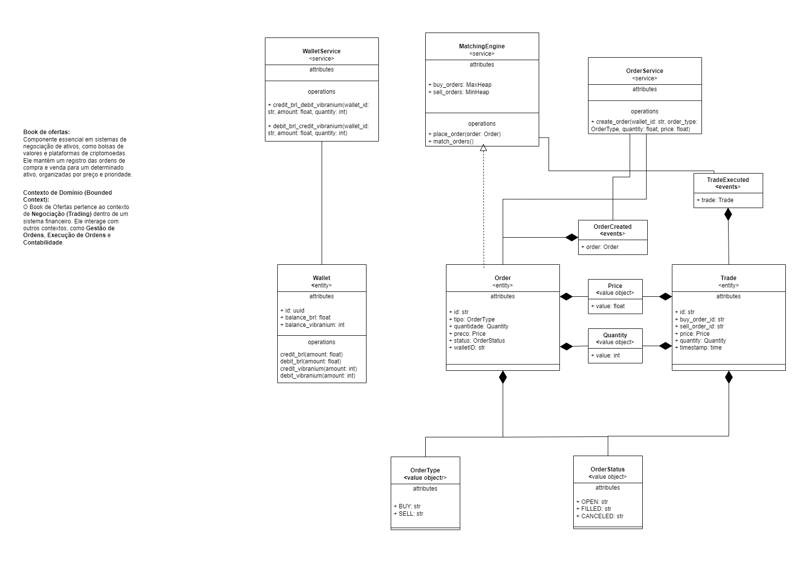

# desafio-meli-order-book
Desafio do processo seletivo do Mercado Livre para desenvolver um Order Book

Este projeto implementa um sistema de Order Book utilizando EventStoreDB para armazenar eventos de transações financeiras. O sistema é composto por múltiplos serviços, incluindo API, Order Service, Wallet Service, Matching Engine, e um Event Store. Todos os serviços são containerizados usando Docker.

## Arquiteturas
Este sistema utiliza uma arquitetura baseada em microserviços orientada a eventos e Event Sourcing para rastrear todas as operações de ordens e transações.

### Arquitetur alto nivel:


- Event Store: Armazena os eventos de transações, ordens e atualizações na carteira.

- Order Service: Gerencia a criação e manipulação de ordens.

- Wallet Service: Gerencia as carteiras dos usuários.

- Matching Engine: Responsável por realizar o match entre ordens de compra e venda.

- Wallet DB & Order DB: bancos em memória para armazenar os objetos Wallet e Order.

- RabbitMQ: Broker/Serviço de mensageria para comunicação assíncrona e orientada a eventos.

- Redis Mutex: Responsável por fazer um lock na Carteira evitar transações concorrentes e trades duplicadas (idempotência)

### Diagrama de Classes UML


## Pré requisitos

Antes de começar, certifique-se de que os seguintes softwares estão instalados:

- [Docker](https://www.docker.com/get-started)
- [Docker Compose](https://docs.docker.com/compose/install/)

## Como rodar o projeto

### 1. Clone o repositório

Primeiro, clone o repositório para a sua máquina local.

```bash
git clone https://github.com/henriquelsz/desafio-meli-order-book.git
cd desafio-meli-order-book
```

### 2. Crie e inicie os containers com Docker Compose
Execute o comando abaixo para construir as imagens dos containers e iniciar os serviços.

```bash
docker compose up --build
```

### 3. Verifique os serviços
Após a execução do comando, os serviços estarão acessíveis nas seguintes portas:

API: `http://0.0.0.0:8000`

EventStoreDB (UI): `http://localhost:2113` (Acesse o painel de administração do EventStoreDB)


### 4. Testando a API
Você pode testar a API enviando requisições para os endpoints configurados. Use ferramentas como Postman ou `curl`.

Exemplos de requisições:
- `POST /wallets`
```bash
curl -X 'POST' \
  'http://0.0.0.0:8000/wallets?wallet_id=wallet_1&balance_brl=10000&balance_vibranium=50' \
  -H 'accept: application/json'
  ```
  Cria uma carteira com id "wallet_1", saldo de R$10000 e 50 ativos Vibranium

  - `POST /orders`
  ```bash
  curl -X 'POST' \
  'http://0.0.0.0:8000/orders?wallet_id=wallet_1&order_type=BUY&quantity=10&price=200' \
  -H 'accept: application/json'
  ```
  Cria uma order do tipo COMPRA, da carteira "wallet_1", para 10 ativos de Vibranium a um valor de R$200
  (Para criar uma order do tipo venda, altere o parametro order_type=SELL)

  - `GET /orderbook`
  ```bash
  curl -X 'GET' \
  'http://0.0.0.0:8000/orderbook' \
  -H 'accept: application/json'
  ```
  Retorna o as ordens abertas no livro de oferta

  - `GET /wallets/{wallet_id}`
  ```bash
  curl -X 'GET' \
  'http://0.0.0.0:8000/wallets/wallet_1' \
  -H 'accept: application/json'
  ```
  Retorna a carteira "wallet_1", informando saldo e quantidade de ativos Vibranium

   - `GET /events`
  ```bash
  curl -X 'GET' \
  'http://0.0.0.0:8000/events' \
  -H 'accept: application/json'
  ```
  Retorna os eventos do EventStore DB

  ### 5. Parar aplicação
  Para parar os containers, use o seguinte comando:
   ```bash
   docker compose down
   ```

## Author

**Henrique Souza**
